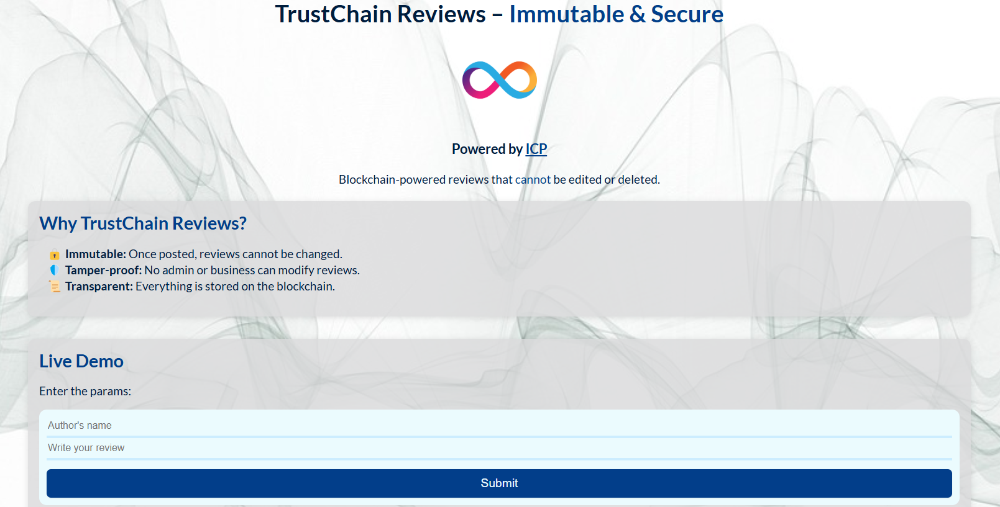
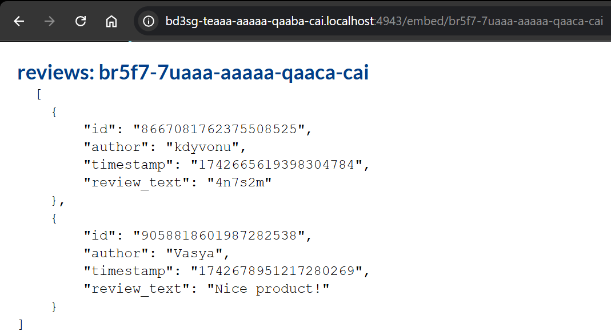
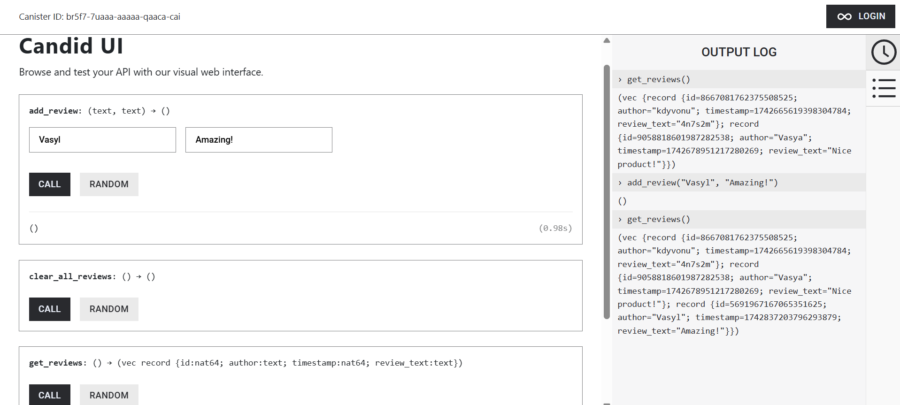

# 🏛 ICP Review App
A blockchain-powered review application that provides immutable, tamper-proof reviews for businesses. Reviews are securely embedded via an iframe to ensure trust and authenticity.

# 🚀 Features
✅Decentralized storage: Reviews are stored on the Internet Computer blockchain.

✅Immutable & tamper-proof: Once a review is submitted, it cannot be altered.

✅Embed via iframe: Businesses can embed their reviews on their own websites.

📌TODO Canister deployment: support creating new canisters for clustering without directly editing an `dfx.json`.

# 📝 Project structure

```
icp_b2b_review_app/
│── src/                              # Smart contract logic (Rust)
│   ├── review_contract/              # Internet Computer (IC) canister storing
│   │   ├── lib.rs                    # Contract code
│   │   ├── review_contract.did       # .did file for contract UI
│   │   ├── Cargo.toml                # Contract Rust dependencies
│── frontend/                         # React frontend app (structure simplified)
│   ├── src/
│   │   ├── App.js                    # Main router
│   │   ├── Main.js                   # Main page
│   │   ├── Review.js                 # Review page (iframe-embeddable)
│   │   ├── idlFactory.js             # IDL interface for interacting with the contract
│── Cargo.toml                        # Rust dependencies
│── Makefile                          # Makefile
│── dfx.json                          # DFINITY configuration file
│── package.json                      # Webpack & dfinity dependencies
│── webpack.config.json               # Webpack configuration
│── README.md                         # Project documentation
```
# 💻 Running project
When running at the first time, ensure that node modules are installed in *frontend* subproject and in the root project with `npm install`.

To run project, you should build the React frontend:
```
cd frontend
npm run build
```
To run the project locally, start DFX at background and deploy it with these commands:
```
dfx start --background
dfx deploy
```
# 💻 Front-end overview

UI consists of 1-page demo, including the brief project description, input to publish a review with author's name and text to the review_contract canister, linked to a main page (*Main.js*)

The review widgets are connected to a canister id passed in URL (*Review.js*)

Front-end canister can serve multiple review canisters UI.

# 🤝 Contract overview
Methods and structs declared in the .did file:
```
type Review = record {
    id: nat64;
    author: text;
    review_text: text;
    timestamp: nat64;
};

type State = record {
    reviews: vec Review;
};

service : {
    get_reviews: () -> (vec Review);
    add_review: (author: text, review_text: text) -> ();
    clear_all_reviews: () -> ();
};
```


Reviews are stored in a stable memory.

# 📦 Deployed app link
Front-end canister: https://ra73r-faaaa-aaaaa-qagta-cai.icp0.io/
Contract canister (Candid UI): https://a4gq6-oaaaa-aaaab-qaa4q-cai.raw.icp0.io/?id=rj4qn-tiaaa-aaaaa-qagsq-cai